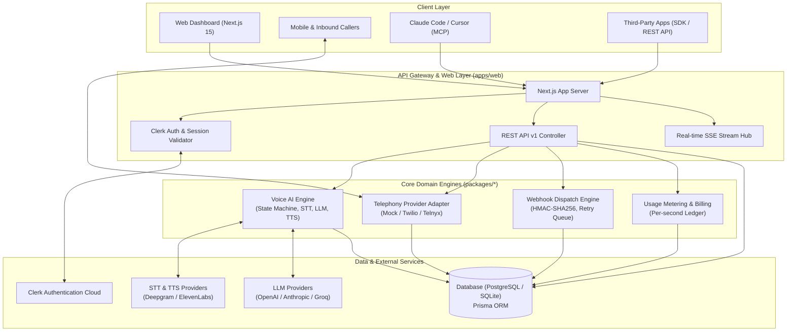
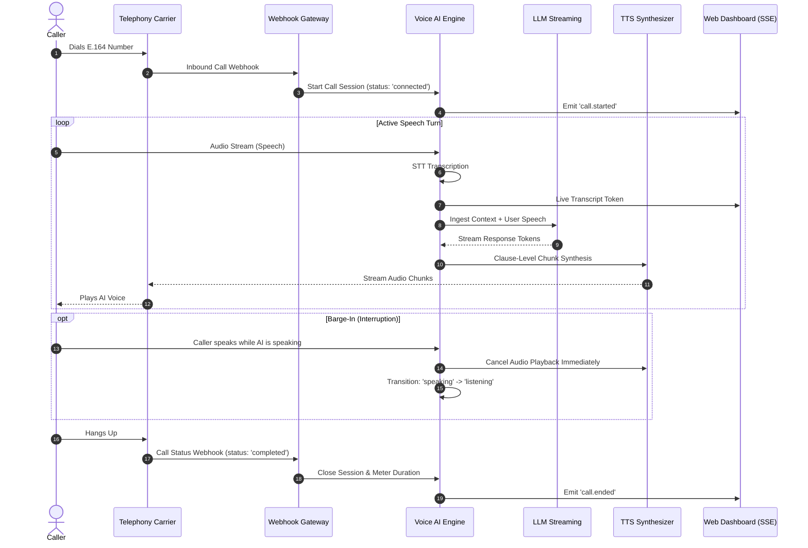

<div align="center">

# Talkie

### Carrier-Grade AI Phone Numbers, Real-Time Bidirectional Voice Calling & Omnichannel Messaging Platform

[](https://nextjs.org/)
[](https://www.typescriptlang.org/)
[](https://clerk.com/)
[](https://www.prisma.io/)
[](https://turbo.build/)
[](LICENSE)

[**🌐 Live Production Demo**](https://talkie-web-gamma.vercel.app/) • [**📖 Documentation Suite**](#-comprehensive-documentation-suite) • [**⚡ Quickstart**](#-quickstart) • [**🛠️ SDKs & MCP**](#-sdks--mcp-server) • [**📡 API Reference**](#-api-reference)

</div>

---

## 🚀 Overview

**Talkie** is an open-source, carrier-grade platform that equips AI agents with dedicated US and Canadian phone numbers. Agents can make and receive phone calls with real-time speech-to-text (STT), low-latency LLM turn-taking, text-to-speech (TTS), and instant speech barge-in interruption detection, while orchestrating omnichannel SMS/MMS, WhatsApp, and Telegram messaging through an HMAC-signed webhook pipeline.

Built as a high-performance TypeScript monorepo, Talkie provides everything needed to build, deploy, and scale autonomous conversational voice applications:

- **Carrier Telephony:** Instant E.164 phone provisioning with programmable inbound/outbound call routing.
- **Voice AI Pipeline:** Sub-second speech processing pipeline with clause-level audio streaming and barge-in cancellation.
- **Omnichannel Threads:** Unified inbox and contact CRM bridging SMS, MMS, WhatsApp, and Telegram.
- **AI Tooling & MCP:** Native Model Context Protocol (MCP) server for Claude Code, Cursor, and autonomous agent frameworks.
- **Enterprise Security:** Multi-tenant workspace isolation, Clerk authentication, SHA-256 API key hashing, and HMAC webhook verification.

---

## ✨ Core Platform Capabilities

### 📞 Instant E.164 Phone Provisioning
Search and provision phone numbers across North American area codes in seconds. Numbers support simultaneous bidirectional voice streaming and two-way SMS/MMS messaging, with instant agent binding and zero downtime.

### 🎙️ Low-Latency Voice AI Pipeline
Engineered for conversational fluidity, Talkie combines streaming Speech-to-Text (STT), dynamic prompt context injection, streaming LLM token generation, and clause-level Text-to-Speech (TTS) chunking. Active voice activity detection (VAD) immediately halts agent audio playback whenever the caller speaks (barge-in interruption).

### 🤖 Hosted & Webhook Agent Modes
- **Hosted Mode:** Talkie manages speech transcription, LLM persona prompts, conversation history, and voice synthesis end-to-end.
- **Webhook Mode:** Talkie streams speech transcript turns to your external server via WebSocket or HTTP, allowing custom backend logic to drive the conversation dynamically.

### 💬 Omnichannel Messaging & CRM
Automated conversation threading with contact identification, delivery receipts, media MMS support, idempotency protection, and automated agent auto-replies across SMS, WhatsApp, and Telegram.

### 🔌 Model Context Protocol (MCP) Server
Equip AI coding tools like Claude Code and Cursor with direct telephony abilities. The native MCP server exposes high-level tools to search numbers, buy numbers, initiate calls, send messages, and fetch live call transcripts.

### 🛡️ Multi-Tenant Security & Role-Based Access Control (RBAC)
Strict organization scoping across all resources. Includes Clerk OAuth/SSO login, session cookies, hierarchical roles (`Owner`, `Admin`, `Developer`, `Member`), cryptographic API key hashing, and HMAC-SHA256 signed webhook delivery.

### 📊 Real-Time Telemetry & Observability
Server-Sent Events (SSE) stream live call statuses, transcript turns, and workspace activity directly to the dashboard without polling. Full structured logging with `X-Request-Id` correlation tracing and health check probes (`/api/health`, `/api/ready`).

### 💳 Usage Metering & Stripe Ledger
Real-time per-second call duration and per-message unit metering with automated balance deduction, usage history tracking, and Stripe top-up integration.

---

## 📚 Comprehensive Documentation Suite

We have thoroughly documented every aspect of Talkie in the [`docs/`](docs/) directory. Whether you are configuring conversational AI agents, extending telephony providers, securing webhook deliveries, or deploying to production, these guides provide deep technical context.

1. **[Architecture & Topology](docs/ARCHITECTURE.md)**: Deep dive into the system topology, monorepo packages, Next.js runtime, Audio WebSockets, and Voice AI Engine.
2. **[Voice AI Pipeline & Turn State Machine](docs/VOICE_PIPELINE.md)**: Detailed breakdown of STT (Deepgram/Whisper), LLM streaming orchestrator, TTS (ElevenLabs/OpenAI), and speech barge-in interruption detection.
3. **[Telephony & Omnichannel Messaging](docs/TELEPHONY.md)**: Carrier provider adapter architecture, mock telephony simulator, WhatsApp/Telegram channel accounts, and conversation threading.
4. **[Data Model & State Machines](docs/DATA_MODEL.md)**: Comprehensive breakdown of the Prisma schema, call lifecycle states, message transitions, and multi-tenant isolation.
5. **[Security, Auth & Multi-Tenancy](docs/SECURITY.md)**: Documentation on Clerk authentication, workspace RBAC, API key hashing, and HMAC-SHA256 signed webhooks.
6. **[UI & Design System](docs/DESIGN_SYSTEM.md)**: Overview of the component architecture, glassmorphism dark aesthetic, Tailwind tokens, and animated state transitions.
7. **[API & Protocol Reference](docs/API.md)**: Internal and public REST API routes, SSE event streams, and Model Context Protocol (MCP) server specifications.
8. **[Deployment & Cloud Topology](docs/DEPLOYMENT.md)**: The exact production topology, Vercel monorepo deployment, Docker containerization, and environment variables.
9. **[Development & Contribution Guide](docs/DEVELOPMENT.md)**: Local development setup, database migrations, testing matrix, and CI/CD pipelines.
10. **[Environment Configuration](docs/ENVIRONMENT.md)**: Master environment variable template and deep-dive explanation for all required telephony, AI, auth, and database keys.

---

## 🏗️ System Architecture



---

## 🔄 Voice AI Turn-Taking Flow



---

## ⚡ Quickstart

### Prerequisites
- **Node.js:** `>= 20.x`
- **Package Manager:** `pnpm >= 10.x`

### 1. Clone & Install Dependencies
```bash
git clone https://github.com/puneetnith28/Talkie.git
cd Talkie
pnpm install
```

### 2. Configure Environment Variables
```bash
cp .env.example .env
```
*(Configure Clerk keys or leave default settings for local exploration).*

### 3. Initialize Database & Seed Demo Data
```bash
pnpm db:generate
pnpm --filter @talkie/database db:push
pnpm --filter @talkie/database db:seed
```

### 4. Start Development Server
```bash
pnpm dev
```
Open **[http://localhost:3000](http://localhost:3000)** to view the landing page, or visit **[http://localhost:3000/dashboard](http://localhost:3000/dashboard)** for the console.

---

## 🛠️ SDKs & MCP Server

### TypeScript / JavaScript SDK (`@talkie/sdk`)

```bash
npm install @talkie/sdk
```

```typescript
import { TalkieClient } from '@talkie/sdk';

const talkie = new TalkieClient({ apiKey: 'tk_live_xxxxxxxxxxxx' });

// 1. Search and provision a phone number
const available = await talkie.numbers.search({ country: 'US', areaCode: '415' });
const number = await talkie.numbers.buy(available[0].phoneNumber);

// 2. Create an AI Voice Agent
const agent = await talkie.agents.create({
  name: 'Customer Support Lead',
  voiceMode: 'hosted',
  systemPrompt: 'You are a friendly and efficient customer support assistant.',
  voice: 'aura-asteria-en',
});

// 3. Make an Outbound AI Call
const call = await talkie.calls.create({
  from: number.phoneNumber,
  to: '+14155550199',
  agentId: agent.id,
});

console.log(`Call initiated with ID: ${call.id}`);
```

### Python SDK (`talkie-sdk`)

```bash
pip install talkie-sdk
```

```python
from talkie import TalkieClient

client = TalkieClient(api_key="tk_live_xxxxxxxxxxxx")

# Send an outbound SMS message
message = client.messages.send(
    from_number="+14155550142",
    to_number="+14155550199",
    body="Hello from Talkie Python SDK!"
)

print(f"Message dispatched: {message.id}")
```

### Model Context Protocol (MCP) Configuration

Add the Talkie MCP server to your `mcp_config.json` (for Claude Code, Cursor, or Windsurf):

```json
{
  "mcpServers": {
    "talkie": {
      "command": "node",
      "args": ["packages/mcp-server/dist/server.js"],
      "env": {
        "TALKIE_API_KEY": "tk_live_xxxxxxxxxxxx",
        "TALKIE_API_URL": "https://talkie-web-gamma.vercel.app/api"
      }
    }
  }
}
```

---

## 📡 API Reference

Interactive OpenAPI documentation is available locally and on production at `/docs`.

| Method | Endpoint | Description |
|---|---|---|
| `GET` | `/api/v1/agents` | List AI agents in workspace |
| `POST` | `/api/v1/agents` | Create a new AI agent |
| `GET` | `/api/v1/numbers` | List all provisioned numbers |
| `POST` | `/api/v1/numbers` | Provision a new carrier number |
| `POST` | `/api/v1/calls` | Initiate an outbound AI call |
| `GET` | `/api/v1/calls/:id` | Get call status, summary, and transcript |
| `POST` | `/api/v1/calls/:id/control` | Send mid-call controls (hangup, transfer) |
| `POST` | `/api/v1/messages` | Send an outbound SMS/MMS message |
| `GET` | `/api/v1/conversations` | List conversation threads |
| `GET` | `/api/v1/contacts` | List CRM contacts |
| `POST` | `/api/v1/webhooks` | Register a webhook endpoint |
| `GET` | `/api/v1/realtime` | Server-Sent Events (SSE) workspace event stream |
| `GET` | `/api/health` | Liveness probe |
| `GET` | `/api/ready` | Readiness probe |

---

## 🚢 Deployment

### Vercel Serverless (Recommended)
1. Import repository to Vercel with Root Directory set to `./`.
2. Configure build command: `pnpm --filter @talkie/database db:generate && pnpm --filter @talkie/web build`.
3. Add environment variables for Clerk, Database URL, and Auth Secret.

### Docker Multi-Stage Build
```bash
# Build production Docker container
docker build -t talkie-platform:latest .

# Run with docker-compose
docker-compose -f docker-compose.prod.yml up -d
```

For complete cloud deployment architectures (Kubernetes, AWS RDS, Neon, Fly.io), refer to [DEPLOYMENT.md](docs/DEPLOYMENT.md).

---

## 🧪 Testing & Code Quality

Talkie includes an end-to-end automated test suite spanning unit, service, and API integration tests:

```bash
# Run Vitest test suites
pnpm test

# Run ESLint validation
pnpm lint

# Check formatting
pnpm format:check
```

---

## 📄 License

This project is licensed under the MIT License — see the [LICENSE](LICENSE) file for details.