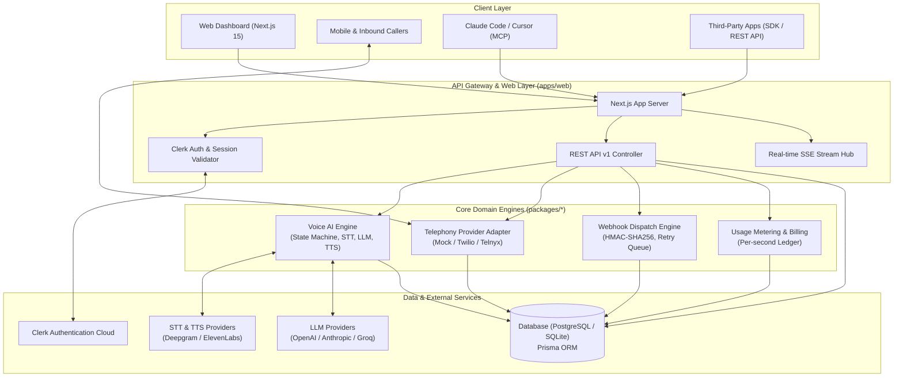

# Talkie — AI Phone Numbers & Omnichannel Voice Platform

<div align="center">

**Carrier-Grade AI Phone Numbers, Real-Time Bidirectional Voice Calling, and Omnichannel Messaging for AI Agents.**

[]()
[]()
[]()
[]()

[Features](#features) • [Quickstart](#quickstart) • [Architecture](#architecture) • [SDKs & MCP](#sdks--mcp-server) • [API Docs](#api-reference) • [Deployment](#deployment)

</div>

---

## Overview

Talkie is an open-source, carrier-grade SaaS platform that equips AI agents with dedicated US and Canadian phone numbers. Agents can make and receive phone calls with real-time speech-to-text (STT), low-latency LLM turn-taking, text-to-speech (TTS), and barge-in interruption detection, while handling omnichannel SMS/MMS messaging through an HMAC-signed webhook pipeline.

---

## Features

- **Instant Phone Provisioning:** Search and provision E.164 phone numbers across US & Canada area codes in seconds.
- **Real-Time Voice AI Engine:** Turn-taking state machine with STT (Deepgram/Whisper), LLM streaming, TTS (ElevenLabs/OpenAI), and speech barge-in interruption handling.
- **Hosted & Webhook Voice Modes:** Choose between fully managed AI conversations or delegating speech turns to your external webhook endpoint.
- **Omnichannel SMS/MMS Messaging:** Automated conversation threading, delivery receipts, idempotency keys, and contact CRM synchronization.
- **Model Context Protocol (MCP) Server:** Native MCP tools for Claude Code, Cursor, and AI agents to manage phone numbers, initiate calls, and send messages.
- **TypeScript & Python SDKs:** Fully typed client libraries (`@talkie/sdk` and `talkie-sdk`) with sync and async support.
- **HMAC Webhook Dispatcher:** SHA-256 signed event delivery (`call.started`, `call.ended`, `message.received`), exponential backoff retries, and dead-letter queue.
- **Developer REST API v1:** Standardized JSON envelopes, OpenAPI 3.0 specification, and interactive documentation at `/docs`.
- **Real-Time Observability:** Server-Sent Events (SSE) live transcript streaming, structured JSON logging with correlation `X-Request-Id` tracing, `/api/health` and `/api/ready` health checks.
- **Usage Metering & Stripe Billing:** Real-time per-second voice call and SMS unit metering with automated balance top-ups.

---

## 📚 Comprehensive Documentation Suite

We have thoroughly documented every aspect of Talkie in the [`docs/`](docs/) directory. Whether you are configuring conversational AI agents, extending telephony providers, securing webhook deliveries, or deploying to production, these guides provide deep technical context.

1. **[Architecture & Topology](docs/ARCHITECTURE.md)**: Deep dive into the system topology, monorepo structure, Next.js Edge/Server runtime, Audio WebSockets, and Voice AI Engine.
2. **[Voice AI Pipeline & Turn State Machine](docs/VOICE_PIPELINE.md)**: Detailed breakdown of STT (Deepgram/Whisper), LLM streaming orchestrator, TTS (ElevenLabs/OpenAI), and speech barge-in interruption detection.
3. **[Telephony & Omnichannel Messaging](docs/TELEPHONY.md)**: Carrier provider adapter architecture, mock telephony simulator, WhatsApp/Telegram channel accounts, and conversation threading.
4. **[Data Model & State Machines](docs/DATA_MODEL.md)**: Comprehensive breakdown of the Prisma schema, call lifecycle states, message transitions, and multi-tenant isolation.
5. **[Security, Auth & Multi-Tenancy](docs/SECURITY.md)**: Documentation on Clerk authentication, workspace RBAC, API key hashing, and HMAC-SHA256 signed webhooks.
6. **[UI & Design System](docs/DESIGN_SYSTEM.md)**: Overview of the component architecture, glassmorphism dark aesthetic, Tailwind tokens, and animated state transitions.
7. **[API & Protocol Reference](docs/API.md)**: Internal and public REST API routes, SSE event streams, and Model Context Protocol (MCP) server specifications.
8. **[Deployment & Cloud Topology](docs/DEPLOYMENT.md)**: The exact production topology, Vercel monorepo deployment, Docker containerization, and environment variables.
9. **[Development & Contribution Guide](docs/DEVELOPMENT.md)**: Local development setup, database migrations, testing matrix, and CI/CD pipelines.
10. **[Environment Configuration](docs/ENVIRONMENT.md)**: Master environment variable template and deep-dive explanation for all required telephony, AI, auth, and database keys.

---

## Architecture



---

## Quickstart

### Prerequisites

- Node.js >= 20.x
- pnpm >= 9.x

### 1. Clone & Install

```bash
git clone https://github.com/talkie/talkie.git
cd talkie
pnpm install
```

### 2. Environment Setup

```bash
cp .env.example .env.development
```

### 3. Database Initialization & Seed

```bash
pnpm --filter @talkie/database db:push
pnpm --filter @talkie/database db:seed
```

### 4. Run Development Server

```bash
pnpm dev
```

Visit `http://localhost:3000` to access the marketing site, or log in to the dashboard at `http://localhost:3000/dashboard`.

---

## SDKs & MCP Server

### TypeScript / JavaScript SDK

```bash
npm install @talkie/sdk
```

```typescript
import { TalkieClient } from '@talkie/sdk';

const talkie = new TalkieClient({ apiKey: 'ap_live_xxxxxxxxxxxx' });

// 1. Search and buy number
const numbers = await talkie.numbers.search({ country: 'US', areaCode: '415' });
const number = await talkie.numbers.buy(numbers[0].phoneNumber);

// 2. Create AI Agent
const agent = await talkie.agents.create({
  name: 'Support Agent',
  voiceMode: 'hosted',
  systemPrompt: 'You are a helpful customer support agent.',
  voice: 'aura-asteria-en',
});

// 3. Make Outbound Call
const call = await talkie.calls.create({
  from: number.phoneNumber,
  to: '+14155550199',
  agentId: agent.id,
});
```

### Python SDK

```bash
pip install talkie-sdk
```

```python
from talkie import TalkieClient

client = TalkieClient(api_key="ap_live_xxxxxxxxxxxx")

# Send SMS message
message = client.messages.send(
    from_number="+14155550142",
    to_number="+14155550199",
    body="Hello from Talkie Python SDK!"
)
print(f"Message dispatched: {message.id}")
```

### Model Context Protocol (MCP) Server

To use Talkie with Claude Code or Cursor, add the following to your `mcp_config.json`:

```json
{
  "mcpServers": {
    "talkie": {
      "command": "node",
      "args": ["packages/mcp-server/dist/server.js"],
      "env": {
        "TALKIE_API_KEY": "ap_live_xxxxxxxxxxxx"
      }
    }
  }
}
```

---

## API Reference

Talkie provides an interactive OpenAPI Swagger UI at `/docs`.

| Method | Endpoint | Description |
|---|---|---|
| `GET` | `/api/v1/agents` | List AI agents |
| `POST` | `/api/v1/agents` | Create a new AI agent |
| `GET` | `/api/v1/numbers` | List provisioned numbers |
| `POST` | `/api/v1/numbers` | Provision a new carrier number |
| `POST` | `/api/v1/calls` | Initiate an outbound AI call |
| `GET` | `/api/v1/calls/:id` | Get call status, summary, and transcript |
| `POST` | `/api/v1/messages` | Send an outbound SMS message |
| `GET` | `/api/v1/conversations` | List conversation threads |
| `GET` | `/api/v1/contacts` | List CRM contacts |
| `POST` | `/api/v1/webhooks` | Register a webhook endpoint |
| `GET` | `/api/v1/realtime` | SSE stream for workspace events |
| `GET` | `/api/health` | Service liveness health check |
| `GET` | `/api/ready` | Service readiness probe |

---

## Deployment

### Docker Multi-Stage Build

```bash
# Build production image
docker build -t talkie-platform:latest .

# Run with docker-compose
docker-compose -f docker-compose.prod.yml up -d
```

For complete cloud deployment architectures (Kubernetes, AWS, Vercel, Fly.io), refer to [DEPLOYMENT.md](docs/DEPLOYMENT.md).

---

## Testing & Quality Assurance

Run the complete 26-suite automated test matrix:

```bash
pnpm test
```

Run ESLint code quality checks:

```bash
pnpm lint
```

---

## License

This project is licensed under the MIT License - see the [LICENSE](LICENSE) file for details.