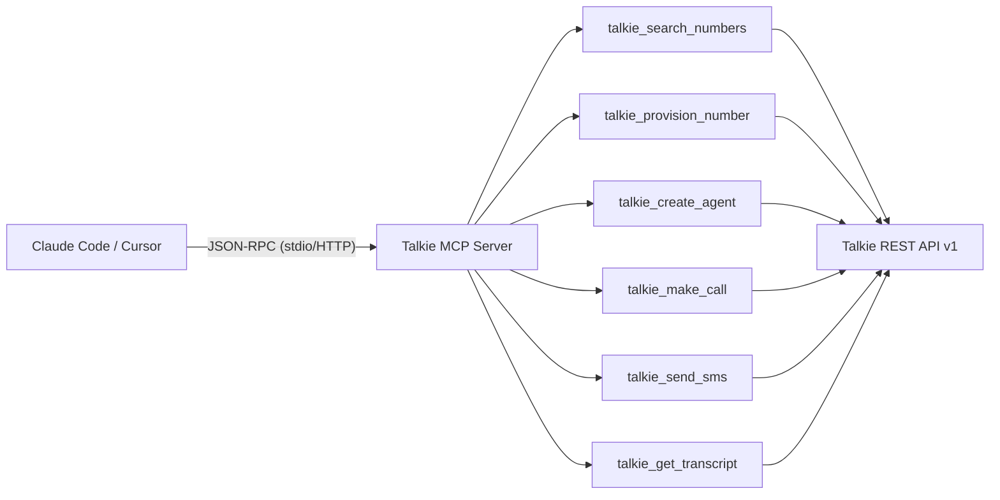

# API & Protocol Reference

Talkie exposes a comprehensive Developer REST API v1, Server-Sent Events (SSE) streaming channels, and a native Model Context Protocol (MCP) server.

---

## 1. REST API Envelope Standard

All responses from `/api/v1/*` follow a predictable JSON envelope:

### Success Response:
```json
{
  "success": true,
  "data": { ... },
  "requestId": "req_01j8xyz123"
}
```

### Error Response:
```json
{
  "success": false,
  "error": {
    "code": "VALIDATION_ERROR",
    "message": "Agent name is required",
    "details": { "name": ["Agent name cannot be empty"] }
  },
  "requestId": "req_01j8xyz123"
}
```

---

## 2. Core API Endpoints

### AI Agents
| Method | Endpoint | Description |
|---|---|---|
| `GET` | `/api/v1/agents` | List all AI agents in workspace |
| `POST` | `/api/v1/agents` | Create a new AI agent |
| `GET` | `/api/v1/agents/:id` | Retrieve agent details |
| `PATCH` | `/api/v1/agents/:id` | Update agent configuration |
| `DELETE` | `/api/v1/agents/:id` | Delete an agent |
| `POST` | `/api/v1/agents/:id/clone` | Duplicate an existing agent |

### Phone Numbers
| Method | Endpoint | Description |
|---|---|---|
| `GET` | `/api/v1/numbers/search` | Search available carrier numbers |
| `POST` | `/api/v1/numbers` | Provision a new phone number |
| `GET` | `/api/v1/numbers` | List all provisioned numbers |
| `PATCH` | `/api/v1/numbers/:id` | Assign or reassign agent |
| `DELETE` | `/api/v1/numbers/:id` | Release phone number |

### Calls & Audio
| Method | Endpoint | Description |
|---|---|---|
| `POST` | `/api/v1/calls` | Initiate an outbound AI call |
| `GET` | `/api/v1/calls` | List recent calls with filters |
| `GET` | `/api/v1/calls/:id` | Retrieve call summary and transcripts |
| `POST` | `/api/v1/calls/:id/control` | Send mid-call controls (hangup, transfer) |
| `GET` | `/api/calls/:id/transcript/stream` | SSE stream of live call transcript |

### Omnichannel Messaging
| Method | Endpoint | Description |
|---|---|---|
| `POST` | `/api/v1/messages` | Send an outbound SMS/MMS |
| `GET` | `/api/v1/conversations` | List conversation threads |
| `GET` | `/api/v1/conversations/:id` | Retrieve conversation history |

### Webhooks & Settings
| Method | Endpoint | Description |
|---|---|---|
| `GET` | `/api/v1/webhooks` | List webhook subscriptions |
| `POST` | `/api/v1/webhooks` | Create a new webhook subscription |
| `POST` | `/api/v1/webhooks/:id/test` | Dispatch a ping test event |
| `GET` | `/api/v1/settings/api-keys` | List API keys |
| `POST` | `/api/v1/settings/api-keys` | Generate a new API key |

---

## 3. Model Context Protocol (MCP) Tools

The Talkie MCP Server (`@talkie/mcp-server`) provides native tools for AI coding assistants (Claude Code, Cursor):


