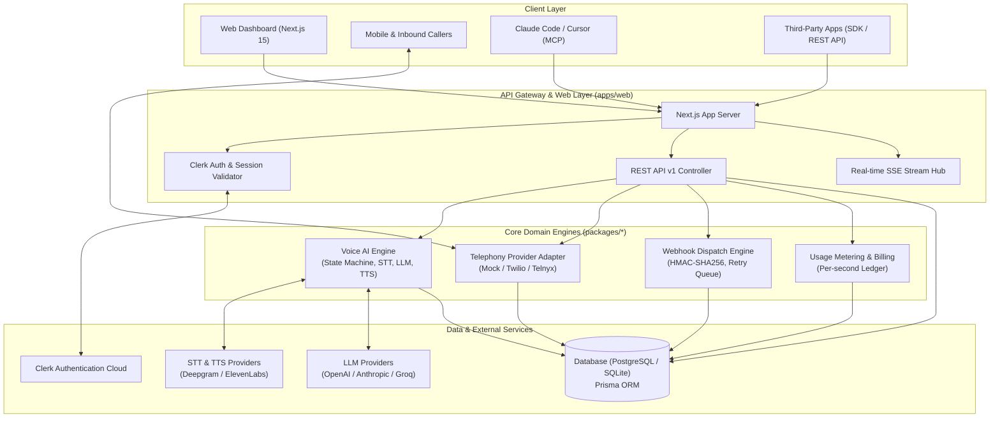
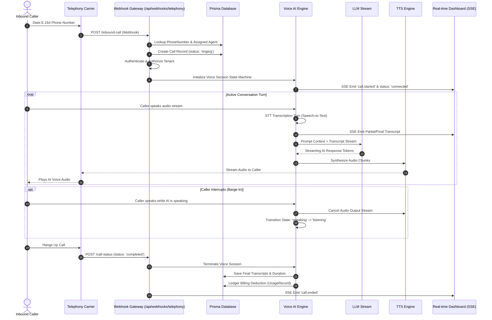
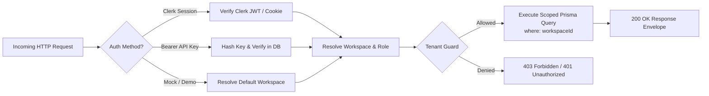

# Architecture & System Topology

Talkie is a carrier-grade AI telephony and omnichannel messaging platform built as a high-performance TypeScript monorepo managed with `pnpm` and `Turborepo`.

---

## 1. Monorepo Structure

```
Talkie/
├── apps/
│   └── web/                     # Next.js 15 (App Router, Tailwind CSS, API Routes v1, WebSockets/SSE)
│
├── packages/
│   ├── database/                # Prisma ORM, Schema, Tenant Services, Migrations, Seeds
│   ├── ui/                      # Shared design system, Glassmorphism primitives, Tailwind tokens
│   ├── config/                  # Zod environment validation schemas & configuration profiles
│   ├── types/                   # Shared TypeScript domain interfaces, DTOs, and event contracts
│   ├── telephony/               # Telephony provider abstractions (Twilio, Telnyx, Mock engine)
│   ├── voice/                   # Voice AI turn state machine, STT, LLM streaming, TTS, Barge-in
│   ├── webhook-engine/          # Webhook delivery queue, HMAC-SHA256 signing, exponential backoff
│   ├── billing/                 # Usage metering engine, per-second ledger, Stripe billing integration
│   ├── sdk-js/                  # Official TypeScript/JavaScript client library (`@talkie/sdk`)
│   ├── sdk-python/              # Official Python client library (`talkie-sdk`)
│   └── mcp-server/              # Model Context Protocol (MCP) server for Claude Code and Cursor
│
├── docs/                        # Complete technical documentation suite
├── tests/                       # Unit, integration, and E2E test suites
└── package.json                 # Monorepo root workspace orchestration
```

---

## 2. High-Level System Architecture



---

## 3. Real-Time Inbound Call Sequence



---

## 4. Multi-Tenant Request Isolation Pipeline

All internal database and service operations enforce strict multi-tenant boundary checks:



---

## 5. Architectural Subsystems

### A. Telephony Abstraction Layer (`@talkie/telephony`)
Decouples upstream business logic from underlying carrier APIs. In development or demo mode, a high-fidelity simulator generates E.164 numbers, delivers simulated SMS, and orchestrates simulated audio turns. In production, adapters communicate with Twilio, Telnyx, or standard SIP trunks.

### B. Voice AI Pipeline (`@talkie/voice`)
Finite State Machine governing call flow:
`idle` → `ringing` → `connected` → `listening` → `thinking` → `speaking` → `interrupted` → `ending` → `ended`.
Includes voice activity detection (VAD), barge-in cancellation, and streaming LLM token buffers.

### C. Webhook Dispatch Engine (`@talkie/webhook-engine`)
Reliable delivery of events (`call.started`, `call.ended`, `message.received`, `transcript.chunk`) to customer endpoints. Payloads are signed with HMAC-SHA256 (`X-Talkie-Signature`) and retried using exponential backoff schedules.

### D. Model Context Protocol Server (`@talkie/mcp-server`)
Enables autonomous AI coding tools (Claude Code, Cursor) and external LLMs to directly search phone numbers, create agents, make outbound calls, and query transcripts via standard JSON-RPC tools.
