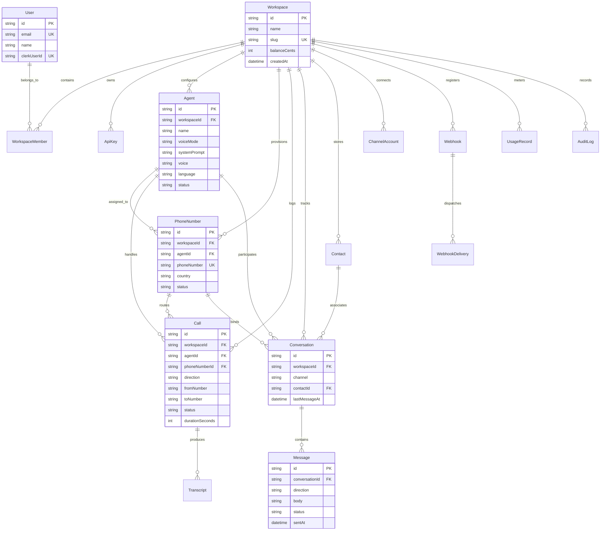
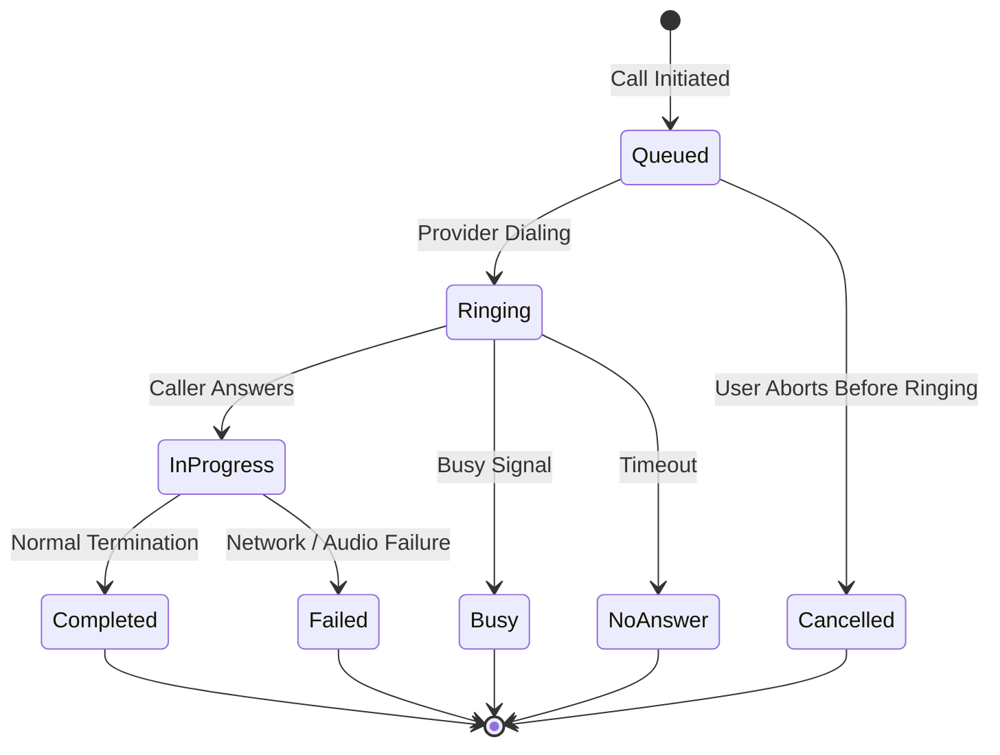
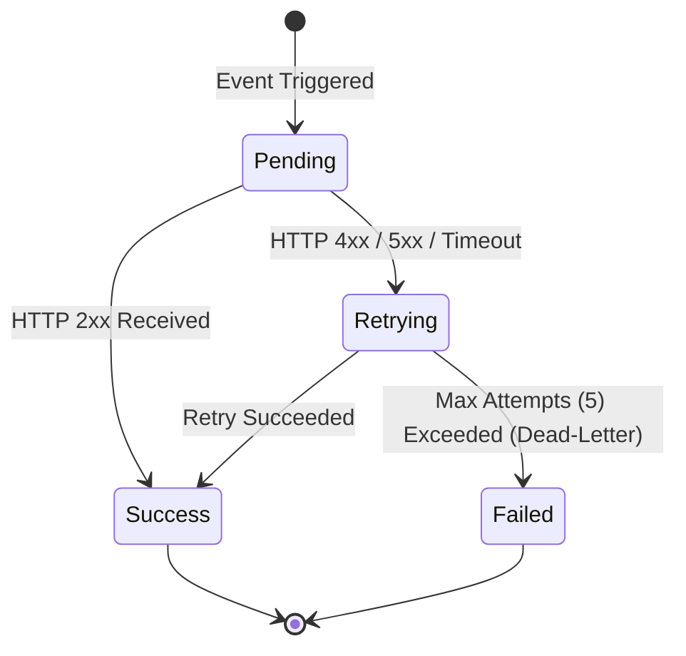

# Data Model & State Machines

Talkie utilizes Prisma ORM with strict multi-tenant isolation across all data models. Every resource is partitioned by `workspaceId` and scoped to its parent organization.

---

## 1. Entity Relationship Diagram (ERD)

---

## 2. Call Lifecycle State Machine

---

## 3. Webhook Delivery State Machine

---

## 4. Multi-Tenant Scoping Rules

1. **Foreign Key Integrity:** All primary application entities (`Agent`, `PhoneNumber`, `Call`, `Conversation`, `Contact`, `Webhook`, `ApiKey`) have mandatory foreign keys to `Workspace` with `onDelete: Cascade`.
2. **Compound Indexes:** Critical lookup paths utilize compound indexes `[workspaceId, id]` or `[workspaceId, status]` to optimize multi-tenant query performance.
3. **Audit Logging:** Administrative operations write immutable records to the `AuditLog` table capturing `userId`, `action`, `resourceType`, `ip`, and timestamp.
