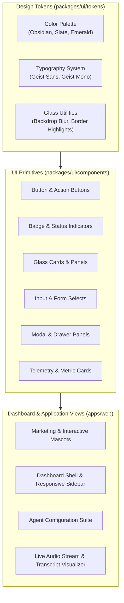
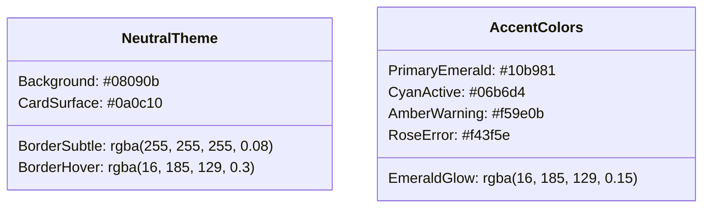

# UI & Design System

Talkie's user interface is built on a dark-first **Glassmorphism Design System** crafted with Tailwind CSS, custom design tokens, and smooth micro-animations.

---

## 1. Design System Architecture

---

## 2. Color Palette & Theming Tokens

Talkie utilizes an obsidian dark palette punctuated by vibrant status accents:

---

## 3. Responsive Layout Strategy

- **Desktop (md & lg screens):** Persistent multi-level collapsible sidebar with contextual quick actions, full analytics dashboards, and multi-pane call inspectors.
- **Mobile (< md screens):** Gesture-friendly sliding drawers, collapsible telemetry cards, stacked list views, and touch-optimized action bars.
- **Accessibility & Focus:** Full keyboard navigation support (`Tab`, `Escape`, `Enter`), ARIA landmarks on interactive controls, and high-contrast text ratios.
