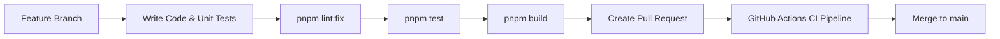

# Development & Contribution Guide

This guide covers local development setup, workflow guidelines, testing procedures, and monorepo management.

---

## 1. Local Environment Prerequisites

- **Node.js:** `>= 20.0.0`
- **Package Manager:** `pnpm >= 10.0.0`
- **Turborepo:** Bundled via `pnpm`
- **Git:** Standard git client

---

## 2. Quick Setup

```bash
# 1. Clone repository
git clone https://github.com/puneetnith28/Talkie.git
cd Talkie

# 2. Install monorepo dependencies
pnpm install

# 3. Setup environment configuration
cp .env.example .env

# 4. Generate Prisma client & initialize database schema
pnpm db:generate
pnpm --filter @talkie/database db:push
pnpm --filter @talkie/database db:seed

# 5. Start development servers
pnpm dev
```

The web application and API will be available at `http://localhost:3000`.

---

## 3. Development Workflow



---

## 4. Useful Scripts & Commands

| Command | Action |
|---|---|
| `pnpm dev` | Start full monorepo development servers with Turborepo |
| `pnpm build` | Build all apps and packages for production |
| `pnpm test` | Run automated Vitest test suite |
| `pnpm lint` | Run ESLint across entire codebase |
| `pnpm format` | Format code using Prettier |
| `pnpm db:generate` | Regenerate Prisma client |
| `pnpm db:push` | Push schema changes directly to local database |
| `pnpm db:seed` | Seed database with demo agents, numbers, and calls |
