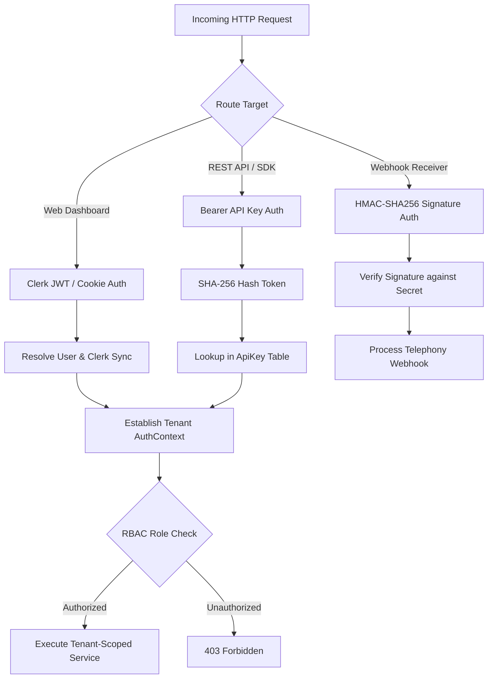
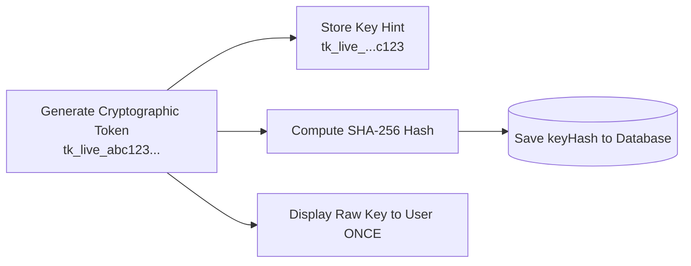

# Security, Authentication & Multi-Tenancy

Talkie adheres to zero-trust security architecture, strict multi-tenant data boundaries, cryptographic API key hashing, and HMAC-SHA256 signature verification for external integrations.

---

## 1. Authentication Architecture

Talkie supports dual authentication vectors:
1. **User Web Session:** Authenticated via Clerk authentication tokens and HTTP-only session cookies.
2. **Programmatic API Keys:** Authenticated via `Authorization: Bearer tk_live_...` headers for SDK and external microservices.



---

## 2. Role-Based Access Control (RBAC) Matrix

Within each workspace, users are assigned one of four hierarchical roles:

| Permission / Action | Owner | Admin | Developer | Member |
|---|:---:|:---:|:---:|:---:|
| **Delete Workspace / Transfer Ownership** | ✅ | ❌ | ❌ | ❌ |
| **Manage Billing & Payment Methods** | ✅ | ✅ | ❌ | ❌ |
| **Manage Members & Invite Users** | ✅ | ✅ | ❌ | ❌ |
| **Create & Revoke API Keys** | ✅ | ✅ | ✅ | ❌ |
| **Manage Webhook Subscriptions** | ✅ | ✅ | ✅ | ❌ |
| **Create & Configure Voice Agents** | ✅ | ✅ | ✅ | ❌ |
| **Provision & Release Phone Numbers** | ✅ | ✅ | ✅ | ❌ |
| **Make Outbound Calls & Send SMS** | ✅ | ✅ | ✅ | ✅ |
| **View Live Calls, Transcripts & Messages** | ✅ | ✅ | ✅ | ✅ |
| **View Workspace Telemetry & Stats** | ✅ | ✅ | ✅ | ✅ |

---

## 3. Cryptographic API Key Management

API keys use the `tk_live_` prefix followed by 32 cryptographically secure random characters.



- **Zero Plaintext Storage:** The raw key is never stored in the database. Only the SHA-256 hash (`keyHash`) and a 4-character suffix (`keyHint`) are retained.
- **Instant Revocation:** Revoked keys (`revokedAt != null`) are immediately rejected at the middleware level.

---

## 4. Webhook HMAC-SHA256 Verification

Every outbound webhook sent by Talkie includes the following security headers:

```http
X-Talkie-Signature: sha256=4f8b9e...3d2a1c
X-Talkie-Timestamp: 1726848000
X-Talkie-Event: call.ended
```

### Signature Verification Algorithm:
```typescript
import crypto from 'crypto';

export function verifyWebhookSignature(
  payload: string,
  signatureHeader: string,
  timestampHeader: string,
  secret: string
): boolean {
  const signedPayload = `${timestampHeader}.${payload}`;
  const expectedSignature = crypto
    .createHmac('sha256', secret)
    .update(signedPayload)
    .digest('hex');

  const providedSignature = signatureHeader.replace('sha256=', '');
  return crypto.timingSafeEqual(
    Buffer.from(expectedSignature, 'hex'),
    Buffer.from(providedSignature, 'hex')
  );
}
```
