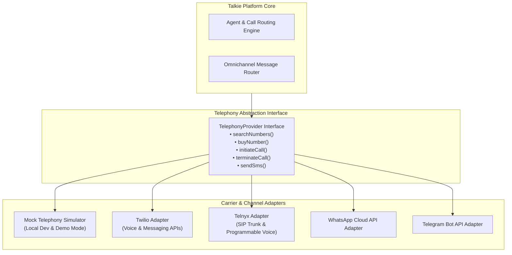
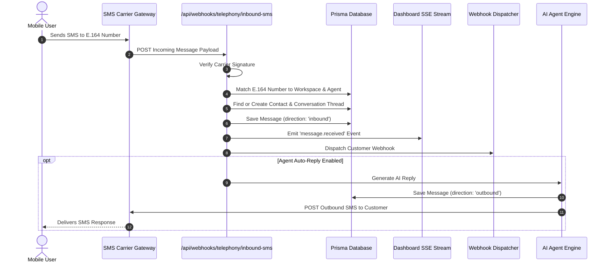
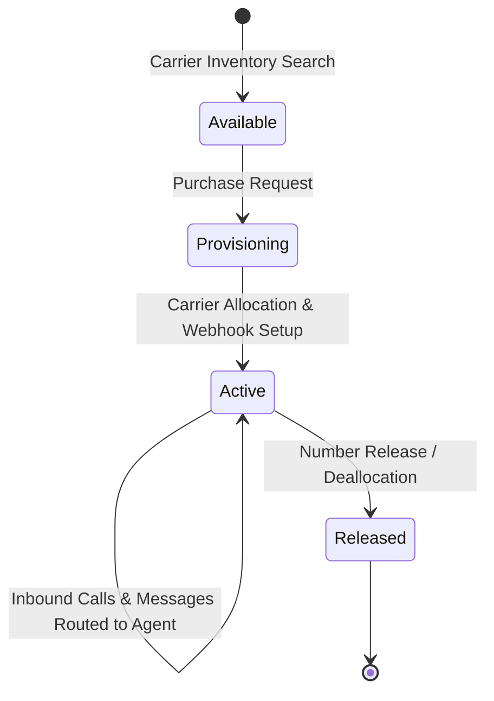

# Telephony & Omnichannel Messaging

Talkie provides an enterprise-grade telephony abstraction layer (`@talkie/telephony`) supporting instant E.164 phone number provisioning, inbound/outbound voice routing, and omnichannel messaging across SMS, MMS, WhatsApp, and Telegram.

---

## 1. Telephony Provider Architecture

---

## 2. Inbound & Outbound SMS Flow

---

## 3. Phone Number Lifecycle

### Number Capabilities:
- **Voice Inbound & Outbound:** Bidirectional speech streaming via WebRTC/SIP.
- **SMS & MMS Messaging:** Text and multimedia content routing with automated conversation threading.
- **Agent Binding:** Dynamic assignment to conversational AI agents with zero carrier reprovisioning downtime.

---

## 4. Omnichannel Channels & Identifiers

| Channel | Identifier Format | Inbound Webhook Route |
|---|---|---|
| **SMS / MMS** | E.164 Phone (`+14155550142`) | `/api/webhooks/telephony/inbound-sms` |
| **Voice Calls** | E.164 Phone (`+14155550142`) | `/api/webhooks/telephony/inbound-call` |
| **WhatsApp** | Phone Number ID (`whatsapp:+14155550142`) | `/api/v1/channels/whatsapp/webhook` |
| **Telegram** | Bot Username / Chat ID (`@TalkieAssistantBot`) | `/api/v1/channels/telegram/webhook` |
