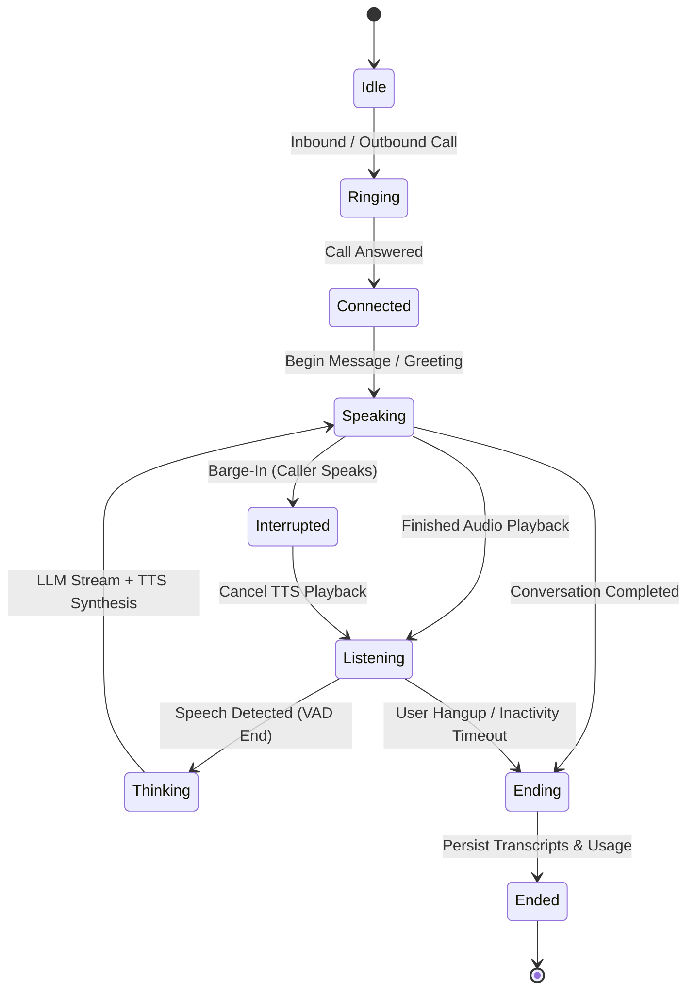

# Voice AI Pipeline & Turn State Machine

Talkie's Voice AI engine (`@talkie/voice`) powers low-latency, bidirectional conversational voice calls with real-time speech-to-text, streaming LLM inference, text-to-speech synthesis, and speech barge-in interruption detection.

---

## 1. Voice State Machine

Each active voice call is managed by an isolated finite state machine (FSM) that controls audio flow and turn-taking:



---

## 2. Audio Pipeline & Latency Optimization

```mermaid
flowchart LR
    subgraph InboundAudio["Inbound Audio Stream"]
        Mic[Caller Audio / WebRTC] --> VAD[Voice Activity Detection]
        VAD --> STT[STT Transcriber\n(Deepgram / Whisper)]
    end

    subgraph LLMOrchestrator["Turn Orchestration"]
        STT --> Context[Context Assembly\n(System Prompt + History)]
        Context --> LLMStream[LLM Streaming Engine\n(OpenAI / Anthropic / Groq)]
    end

    subgraph OutboundAudio["Outbound Synthesis"]
        LLMStream --> SentenceBuffer[Sentence & Clause Chunking]
        SentenceBuffer --> TTS[TTS Engine\n(ElevenLabs / Cartesia / OpenAI)]
        TTS --> AudioStream[Audio Output Stream to Carrier]
    end

    subgraph Interruption["Barge-In Handler"]
        VAD -.->|Voice Detected during Speaking| CancelSignal[Cancel Active Stream]
        CancelSignal -.-> AudioStream
    end
```

---

## 3. Core Components

### A. Speech-to-Text (STT)
- **Streaming Audio Ingestion:** Converts incoming audio chunks (mulaw 8kHz, PCM 16kHz) to text turns.
- **Interim vs Final Transcripts:** Emits interim partial tokens for instant UI preview and final transcript tokens upon silence detection.
- **Provider Support:** Deepgram Nova-2, OpenAI Whisper, and local mock speech simulation.

### B. LLM Turn Orchestration & Prompt Assembly
- **Dynamic Context Injection:** Injects workspace agent persona, knowledge guidelines, conversation history, and CRM contact details.
- **Low Latency Token Streaming:** Streams output tokens directly to the sentence buffer without waiting for full completion.
- **Function Calling & Tools:** Supports live tool invocation during calls (e.g., booking appointments, looking up account balances).

### C. Text-to-Speech (TTS) & Sentence Chunking
- **Clause-Level Synthesis:** Splits streaming LLM output at natural punctuation marks (`.`, `!`, `?`, `,`, `;`) to begin audio synthesis before the full sentence is generated.
- **Voice Customization:** Configurable voice IDs (ElevenLabs, Deepgram Aura, OpenAI), speaking rate, pitch, and stability.

### D. Barge-In & Speech Interruption
- When caller speech is detected while the agent is in the `speaking` state, the engine triggers an immediate abort signal:
  1. Closes the current TTS audio stream chunk.
  2. Flushes the carrier audio buffer.
  3. Records the interrupted turn in the transcript timeline.
  4. Transitions state machine to `listening` to process the caller's new input.

---

## 4. Voice Configuration Parameters

Agents can be configured with fine-tuned voice parameters:

| Parameter | Type | Default | Description |
|---|---|---|---|
| `voiceMode` | `string` | `"hosted"` | `"hosted"` (managed AI) or `"webhook"` (delegated to customer server) |
| `voice` | `string` | `"aura-asteria-en"` | Target TTS voice persona identifier |
| `voiceSpeed` | `float` | `1.0` | Speech playback rate multiplier (0.5x to 2.0x) |
| `interruptionSensitivity` | `float` | `0.5` | Threshold for detecting barge-in voice activity (0.0 to 1.0) |
| `enableBackchannel` | `boolean` | `true` | Enables subtle audio listening acknowledgements ("uh-huh", "got it") |
| `denoisingMode` | `string` | `"standard"` | Audio background noise suppression filter |
| `maxSilenceMs` | `integer` | `2000` | Silence duration before considering speech turn completed |
